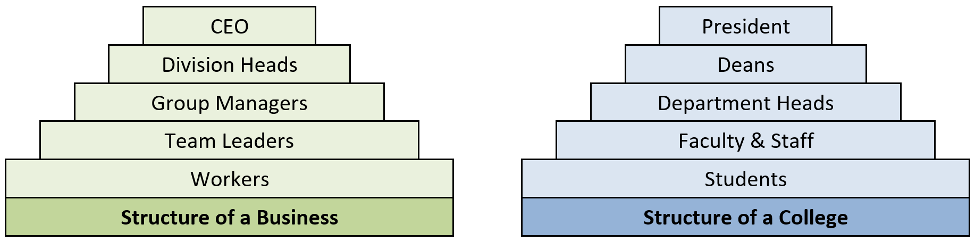

== Activity 1: Free and Open Source Software (FOSS)

This activity introduces the concepts of FOSS. It then investigates some
elements, structures, roles and principles shared by many (but not all)
FOSS.

=== Content Learning Objectives

_After completing this activity, students should be able to:_

* Describes the general concepts and the main terms of FOSS.
* Describe reasons that individuals support & participate in FOSS
projects, including but not limited to financial incentives.
* Describe roles in a typical FOSS project, and how people transition
between roles.

=== Process Skill Goals

_During the activity, students should make progress toward:_

* Teamwork
* Information processing

=== Team Roles

* _Before you start, make sure everyone in your team has a new role (not
the same role as the last activity)._
* _If you have three people, combine the Manager and Reflector roles._

_Record role assignments here._

* Manager:
* Presenter:
* Recorder:
* Reflector:

=== Model 1: FOSS Introduction

==== Information

An open source software community is a group of people united by the
shared purpose of developing, maintaining, extending, and promoting a
specific body of open source software. These communities are often
globally distributed—their members occupy different geographic regions
and work across numerous industries. What unites them is their common
vision for the open source software project—as well as the spirit of
camaraderie and collective identity that participating in the community
affords them.

____
*INSTRUCTOR*

For this model, instructors can choose to:

* Post the video as homework before class starts
* Play the video in the classroom before students start working on the
model.

The video duration is 5:41 sec.
____

==== Instructions and Questions (15 min)

[arabic]
. Watch the ``Open Source Basics'' video by Sarah Moyle for Intel
Software. The video uses ``family cookies recipe'' as a metaphor for the
processes that FOSS communities use to collaborate.
+
https://www.youtube.com/watch?v=Tyd0FO0tko8
+
As a team, discuss these terms from the video and agree on a brief
description for each of them (your descriptions can be changed or
enhanced in the next POGIL activities):
[loweralpha]
.. Roles:
.. Rules -> License:
.. Contributor:
.. Maintainer:
.. Upstreaming:
.. Branch / Patch:
.. Main branch:
.. Fork:
. What does ``Upstream early and often'' mean? and why we need to do it?
. Who makes up the community in the Cookie example?
. What are some challenges that an open source community will face?
+
____
*POTENTIAL ANSWERS*

* Coordination and Collaboration
* globally distributed
* different regions / languages / time zones
* different industries
____
. What advantages/opportunities does an open source community afford?
+
____
*POTENTIAL ANSWERS*

* *larger community*
* *more diverse community*
* *varied perspectives*
* *distinct skill sets and expertise*
____

=== Model 2: FOSS Motivations

==== Information

===== Motivations

In 2001, Karim Lakhani and Robert Wolf surveyed 684 developers in 287
FOSS projects to understand why they contributed to FOSS. The table
below summarizes their survey results.

[width="100%",cols="29%,14%,20%,37%",options="header",]
|===
|Motivation |% all |% paid |% volunteers
|This code is intellectually stimulating to write. |45% |43% |46%

|They liked working with the development team. |20% |18% |21%

|Improve programming skills. |41% |33% |46%

|Code is needed for work. |34% |56% |19%

|Code is needed for non-work. |30% |19% |37%

|Enhance professional status. |17% |23% |14%

|They believe that source code should be open. |33% |31% |35%

|They feel an obligation to contribute because of the use of FOSS. |29%
|27% |30%

|Dislike proprietary software. |11% |11% |11%

|Improve one’s reputation in the FOSS community. |11% |9% |12%
|===

==== Instructions and Questions (10 min)

[arabic]
. Based on the above table, answer the following questions (answer using
the bold words from the table such as; *stimulating, team* ... etc.):
[loweralpha]
.. Column 2 shows responses from *all* participants. What are their two
most common motivations?
+
____
*ANSWERS:* stimulating, skills
____
[loweralpha, start=2]
.. What are their next four most common motivations?
+
____
*ANSWERS:* work, open, non-work, obligation
____
[loweralpha, start=3]
.. Column 3 shows responses from *paid* contributors. What are their two
most common motivations?
+
____
*ANSWERS:* stimulating, work
____
[loweralpha, start=4]
.. What are their next three most common motivations?
+
____
*ANSWERS:* skill, open, status
____
[loweralpha, start=5]
.. Column 4 shows responses from unpaid *volunteers*. What are their two
most common motivations?
+
____
*ANSWERS:* stimulating, skills
____
[loweralpha, start=6]
.. What are their next three most common motivations?
+
____
*ANSWERS:* non-work, open, motivation
____
[loweralpha, start=7]
.. Some motivations are similar for paid and volunteer work developers.
What are the two biggest differences in motivation?
+
____
*ANSWERS:* work, non-work
____
[loweralpha, start=8]
.. What are the next two biggest differences?
+
____
*ANSWERS:* skills, status
____
. Motivations can be classified into two categories: motivations based
on __personal enjoyment or fulfillmen__t and motivations based on
_community obligations_. List the motivations (obligation, stimulating,
team, reputation, skills, work, non-work, status, open, dislike,
non-work) in each category:
[loweralpha]
.. personal enjoyment or fulfillment
+
____
*ANSWERS:* stimulating, team, skills, work, non-work, status
____
[loweralpha, start=2]
.. obligations or community
+
____
*ANSWERS:* open, obligation, dislike, reputation
____

=== Model 3: FOSS Principles

==== Information

Principles of FOSS Communities:

* Transparency.
* Collaboration.
* Release early and often.
* Inclusive meritocracy.
* Community.

Read more about the principles in:
https://opensource.com/open-source-way

==== Instructions and Questions (10 min)

[arabic]
. Discuss the meaning of these words (Principles) and what do you think
they mean in the context of a FOSS community?
. Why are these principles good things?
. Consider each of the following statements about the operation of a
FOSS community and label it with the principle (or principles if
multiple apply) with which it most closely aligns.
[loweralpha]
.. By building on each other’s work the community can solve problems
that no one could solve alone. Principles:
.. Decisions and the rationale for them are available to the community.
Principles:
.. The mission and goals of the community are more important than
individual agendas. Principles:
.. The best ideas should win, regardless of where they come from.
Principles:
.. Incorporating new changes and features quickly generates feedback and
leads to rapid improvement. Principles:
.. Community members enhance and extend what others contribute in
unanticipated ways. Principles:
.. Decision makers continually seek diverse perspectives. Principles:
.. All community members have access to the information necessary to do
their best work. Principles:

=== Model 4: FOSS Community Structures

==== Information

Below, two examples of pyramidal-structured organizations (_non-FOSS_).

==== Instructions and Questions (15 min)

[arabic]
. As shown above, in many organizations, people are in a *pyramidal
structure*.
[loweralpha]
.. What is the largest group of people in a college and in a business?
+
____
*ANSWERS:* Students
____
[loweralpha, start=2]
.. What is the level above workers in a business?
+
____
*ANSWERS:* Team Leaders
____
. As we move down the pyramid (from top to bottom):
[loweralpha]
.. Do responsibility and authority go up or down?
+
____
*ANSWERS:* down
____
[loweralpha, start=2]
.. Does the number of people go up or down?
+
____
*ANSWERS:* up
____
. Most large FOSS projects also have a pyramidal structure, but with
different roles.
[loweralpha]
.. *Contributors* who add patches and test cases.
.. *Core team* of developers who work on the code, test suites, and
documentation.
.. *Leaders* who make key decisions and consider long-term project
goals.
.. *Requesters* who report defects and ask for new features.
.. *Users* who download and use the software.
+
Put these roles (a-e) above in the correct order in the pyramid below:
+
....
1.  (top)
2.
3.
4.
5.  (bottom)
....
+
____
*ANSWERS:*

[arabic]
.. {blank}
[loweralpha, start=3]
... Leaders
.. {blank}
[loweralpha, start=2]
... Core Team
.. {blank}
[loweralpha]
... Contributors
.. {blank}
[loweralpha, start=4]
... Requestors
.. {blank}
[loweralpha, start=5]
... Users
____
. In a typical FOSS project:
[loweralpha]
.. Which role has the largest number of people?
+
____
*ANSWERS:* User
____
[loweralpha, start=2]
.. Which role has the smallest number of people?
+
____
*ANSWERS:* Leader
____
[loweralpha, start=3]
.. What is the most likely role for the people who started the project?
+
____
*ANSWERS:* Leader
____
[loweralpha, start=4]
.. Which role could a typical user easily transition to if they wanted
to contribute more to the project?
+
____
*ANSWERS:* Requester
____
[loweralpha, start=5]
.. Which role is most likely to provide new leaders for the project?
+
____
*ANSWERS:* Core
____
[loweralpha, start=6]
.. Which role is most likely to provide new contributors?
+
____
*ANSWERS:* Requester
____
. Consider each of the actions described below. For each action, label
it with the role of the individual (or individuals if multiple apply)
that is _most likely_ to be responsible for the action.
[loweralpha]
.. Choosing the license under which the project will be released.
+
Roles:
.. Using the software in a new, unanticipated or creative way.
+
Roles:
.. Asking that a useful new feature be added to the software.
+
Roles:
.. Discovering a bug in the software.
+
Roles:
.. Providing a code patch that fixes a bug in the software.
+
Roles:
.. Submitting an improved set of installation instructions.
+
Roles:
.. Documenting a bug in the issue tracker so others can fix it.
+
Roles:
.. Defining the goals for the next year of work on the project.
+
Roles:
.. Incorporating a contributed bug fix into the main branch.
+
Roles:
.. Redesigning a critical software module in the system.
+
Roles:

=== Model 5: FOSS Anatomy

==== Information

Open-source projects have a distinct culture and set of tools that
support project development. The form of the culture and the specific
tools vary somewhat across projects, but there is significant
commonality such that many open source developers migrate easily among
open source projects. This model focuses on Sugar Labs, a
well-established humanitarian open source (FOSS) project.

==== Instructions and Questions (15 min)

[arabic]
. Listed below are several important starting points for the _Sugar
Labs_ project. Take a quick look at each and then answer the questions
below.
* http://sugarlabs.org/
* https://wiki.sugarlabs.org/go/Welcome\_to\_the\_Sugar\_Labs\_wiki
* https://github.com/sugarlabs
* https://github.com/sugarlabs/sugar-docs
+
Answer the following questions:
[loweralpha]
.. Which of the links above would be the best starting point for someone
interested in using Sugar?
.. Which of the links above would be the best starting point for someone
interested in contributing to Sugar?
. Check the
https://wiki.sugarlabs.org/go/Sugar_Labs/Getting_Involved[Getting
Involved] page which describes the roles of various contributors to
Sugar Labs. Note that there are a variety of different types of
contributions that may be made by people in different roles.
+
Answer the following questions:
[loweralpha]
.. What roles do you think would be most applicable for a new
participant?
.. What are the commonalities across roles? What are the differences?

=== Team’s Reflection (5 min)

* _Reflector:_ lead the discussion to review the team’s performance
during the activity. The team must discuss two positive points and two
areas for improvement for the next activities.
* _Recorder:_ type the discussion’s summary.
* _Reflector:_ be ready to present the points when asked.

=== References & Resources

* https://gitlab.com/hfossedu/kits/GitKit
* http://foss2serve.org/index.php/Intro_to_FOSS_Project_Anatomy_(Activity)
* K Crowston, J Howison (2005)
https://firstmonday.org/article/view/1207/1127[The social structure of
FOSS development]. _First Monday_ 10(2).
* C Jensen, W Scacchi (2007)
http://ieeexplore.ieee.org/document/4222598/[Role migration and
advancement processes in OSSD projects: A comparative case study]. In
_Proc. of the 29th Int’l Conf. on Software Engineering (ICSE’07)_
(pp. 364–374). IEEE Computer Society.
* KR Lakhani, RG Wolf (2003)
http://papers.ssrn.com/sol3/Papers.cfm?abstract_id=443040[Why hackers do
what they do: Understanding motivation & effort in FOSS projects]. _MIT
Sloan Working Paper_ 4425-03.
* CG Wu, JH Gerlach, & CE Young (2007)
https://www.sciencedirect.com/science/article/abs/pii/S0378720607000067[An
empirical analysis of OSS motivations & intentions]. _Information &
Management_ 44(3):253-262.
* Y Ye, K Kishida (2003)
https://dl.acm.org/citation.cfm?id=776867[Toward an understanding of the
motivation of open source software developers]. _Int’l Conf. on Software
Engineering_, 419-429.
* The Open Source Way 2.0
https://www.theopensourceway.org/the\_open\_source\_way-guidebook2.0.html

'''''

© 2010-2023 by Clif Kussmaul, Greg Hislop, Lori Postner, Heidi Ellis,
Ali Al-Faris. This work is licensed under a Creative Commons
Attribution-NonCommercial-ShareAlike 4.0 International License. *(Needs
update)*
