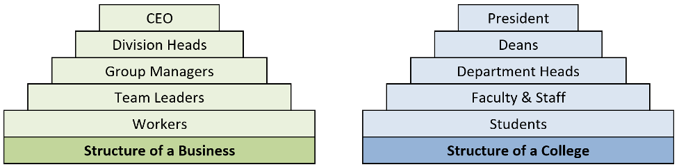

Activity 1: Free and Open Source Software (FOSS)
================================================

This activity introduces the concepts of FOSS. It then investigates some
elements, structures, roles and principles shared by many (but not all)
FOSS.

Content Learning Objectives
---------------------------

*After completing this activity, students should be able to:*

-   Describes the general concepts and the main terms of FOSS.

-   Describe reasons that individuals support & participate in FOSS
    projects, including but not limited to financial incentives.

-   Describe roles in a typical FOSS project, and how people transition
    between roles.

Process Skill Goals
-------------------

*During the activity, students should make progress toward:*

-   Teamwork

-   Information processing

Team Roles
----------

-   *Before you start, make sure everyone in your team has a new role
    (not the same role as the last activity).*

-   *If you have three people, combine the Manager and Reflector roles.*

*Record role assignments here.*

-   Manager:

-   Presenter:

-   Recorder:

-   Reflector:

Model 1: FOSS Introduction
--------------------------

### Information

An open source software community is a group of people united by the
shared purpose of developing, maintaining, extending, and promoting a
specific body of open source software. These communities are often
globally distributed—their members occupy different geographic regions
and work across numerous industries. What unites them is their common
vision for the open source software project—as well as the spirit of
camaraderie and collective identity that participating in the community
affords them.

> **INSTRUCTOR**
>
> For this model, instructors can choose to:
>
> -   Post the video as homework before class starts
>
> -   Play the video in the classroom before students start working on
>     the model.
>
> The video duration is 5:41 sec.

### Instructions and Questions (15 min)

1.  Watch the “Open Source Basics” video by Sarah Moyle for Intel
    Software. The video uses “family cookies recipe” as a metaphor for
    the processes that FOSS communities use to collaborate.

    <https://www.youtube.com/watch?v=Tyd0FO0tko8>

    As a team, discuss these terms from the video and agree on a brief
    description for each of them (your descriptions can be changed or
    enhanced in the next POGIL activities):

    1.  Roles:

    2.  Rules → License:

    3.  Contributor:

    4.  Maintainer:

    5.  Upstreaming:

    6.  Branch / Patch:

    7.  Main branch:

    8.  Fork:

2.  What does “Upstream early and often” mean? and why we need to do it?

3.  Who makes up the community in the Cookie example?

4.  What are some challenges that an open source community will face?

    > **POTENTIAL ANSWERS**
    >
    > -   Coordination and Collaboration
    >
    > -   globally distributed
    >
    > -   different regions / languages / time zones
    >
    > -   different industries

5.  What advantages/opportunities does an open source community afford?

    > **POTENTIAL ANSWERS**
    >
    > -   **larger community**
    >
    > -   **more diverse community**
    >
    > -   **varied perspectives**
    >
    > -   **distinct skill sets and expertise**

Model 2: FOSS Motivations
-------------------------

### Information

#### Motivations

In 2001, Karim Lakhani and Robert Wolf surveyed 684 developers in 287
FOSS projects to understand why they contributed to FOSS. The table
below summarizes their survey results.

<table>
<colgroup>
<col style="width: 28%" />
<col style="width: 14%" />
<col style="width: 20%" />
<col style="width: 36%" />
</colgroup>
<thead>
<tr class="header">
<th>Motivation</th>
<th>% all</th>
<th>% paid</th>
<th>% volunteers</th>
</tr>
</thead>
<tbody>
<tr class="odd">
<td>
This code is intellectually stimulating to write.
</td>
<td>
45%
</td>
<td>
43%
</td>
<td>
46%
</td>
</tr>
<tr class="even">
<td>
They liked working with the development team.
</td>
<td>
20%
</td>
<td>
18%
</td>
<td>
21%
</td>
</tr>
<tr class="odd">
<td>
Improve programming skills.
</td>
<td>
41%
</td>
<td>
33%
</td>
<td>
46%
</td>
</tr>
<tr class="even">
<td>
Code is needed for work.
</td>
<td>
34%
</td>
<td>
56%
</td>
<td>
19%
</td>
</tr>
<tr class="odd">
<td>
Code is needed for non-work.
</td>
<td>
30%
</td>
<td>
19%
</td>
<td>
37%
</td>
</tr>
<tr class="even">
<td>
Enhance professional status.
</td>
<td>
17%
</td>
<td>
23%
</td>
<td>
14%
</td>
</tr>
<tr class="odd">
<td>
They believe that source code should be open.
</td>
<td>
33%
</td>
<td>
31%
</td>
<td>
35%
</td>
</tr>
<tr class="even">
<td>
They feel an obligation to contribute because of the use of FOSS.
</td>
<td>
29%
</td>
<td>
27%
</td>
<td>
30%
</td>
</tr>
<tr class="odd">
<td>
Dislike proprietary software.
</td>
<td>
11%
</td>
<td>
11%
</td>
<td>
11%
</td>
</tr>
<tr class="even">
<td>
Improve one’s reputation in the FOSS community.
</td>
<td>
11%
</td>
<td>
9%
</td>
<td>
12%
</td>
</tr>
</tbody>
</table>

### Instructions and Questions (10 min)

1.  Based on the above table, answer the following questions (answer
    using the bold words from the table such as; **stimulating, team** …
    etc.):

    1.  Column 2 shows responses from **all** participants. What are
        their two most common motivations?

        > **ANSWERS:** stimulating, skills

    2.  What are their next four most common motivations?

        > **ANSWERS:** work, open, non-work, obligation
        >
        > —  start=2

    3.  Column 3 shows responses from **paid** contributors. What are
        their two most common motivations?

        > **ANSWERS:** stimulating, work
        >
        > —  start=3

    4.  What are their next three most common motivations?

        > **ANSWERS:** skill, open, status
        >
        > —  start=4

    5.  Column 4 shows responses from unpaid **volunteers**. What are
        their two most common motivations?

        > **ANSWERS:** stimulating, skills
        >
        > —  start=5

    6.  What are their next three most common motivations?

        > **ANSWERS:** non-work, open, motivation
        >
        > —  start=6

    7.  Some motivations are similar for paid and volunteer work
        developers. What are the two biggest differences in motivation?

        > **ANSWERS:** work, non-work
        >
        > —  start=7

    8.  What are the next two biggest differences?

        > **ANSWERS:** skills, status
        >
        > —  start=8

2.  Motivations can be classified into two categories: motivations based
    on *personal enjoyment or fulfillmen*t and motivations based on
    *community obligations*. List the motivations (obligation,
    stimulating, team, reputation, skills, work, non-work, status, open,
    dislike, non-work) in each category:

    1.  personal enjoyment or fulfillment

        > **ANSWERS:** stimulating, team, skills, work, non-work, status

    2.  obligations or community

        > **ANSWERS:** open, obligation, dislike, reputation
        >
        > —  start=2

Model 3: FOSS Principles
------------------------

### Information

Principles of FOSS Communities:

-   Transparency.

-   Collaboration.

-   Release early and often.

-   Inclusive meritocracy.

-   Community.

Read more about the principles in:
<https://opensource.com/open-source-way>

### Instructions and Questions (10 min)

1.  Discuss the meaning of these words (Principles) and what do you
    think they mean in the context of a FOSS community?

2.  Why are these principles good things?

3.  Consider each of the following statements about the operation of a
    FOSS community and label it with the principle (or principles if
    multiple apply) with which it most closely aligns.

    1.  By building on each other’s work the community can solve
        problems that no one could solve alone. Principles:

    2.  Decisions and the rationale for them are available to the
        community. Principles:

    3.  The mission and goals of the community are more important than
        individual agendas. Principles:

    4.  The best ideas should win, regardless of where they come from.
        Principles:

    5.  Incorporating new changes and features quickly generates
        feedback and leads to rapid improvement. Principles:

    6.  Community members enhance and extend what others contribute in
        unanticipated ways. Principles:

    7.  Decision makers continually seek diverse perspectives.
        Principles:

    8.  All community members have access to the information necessary
        to do their best work. Principles:

Model 4: FOSS Community Structures
----------------------------------

### Information

Below, two examples of pyramidal-structured organizations (*non-FOSS*).

### Instructions and Questions (15 min)

1.  As shown above, in many organizations, people are in a **pyramidal
    structure**.

    1.  What is the largest group of people in a college and in a
        business?

        > **ANSWERS:** Students

    2.  What is the level above workers in a business?

        > **ANSWERS:** Team Leaders
        >
        > —  start=2

2.  As we move down the pyramid (from top to bottom):

    1.  Do responsibility and authority go up or down?

        > **ANSWERS:** down

    2.  Does the number of people go up or down?

        > **ANSWERS:** up
        >
        > —  start=2

3.  Most large FOSS projects also have a pyramidal structure, but with
    different roles.

    1.  **Contributors** who add patches and test cases.

    2.  **Core team** of developers who work on the code, test suites,
        and documentation.

    3.  **Leaders** who make key decisions and consider long-term
        project goals.

    4.  **Requesters** who report defects and ask for new features.

    5.  **Users** who download and use the software.

        Put these roles (a-e) above in the correct order in the pyramid
        below:

            1.  (top)
            2.
            3.
            4.
            5.  (bottom)

        > **ANSWERS:**
        >
        > 1.  1.  Leaders
        >
        > 2.  1.  Core Team
        >
        > 3.  1.  Contributors
        >
        > 4.  1.  Requestors
        >
        > 5.  1.  Users

4.  In a typical FOSS project:

    1.  Which role has the largest number of people?

        > **ANSWERS:** User

    2.  Which role has the smallest number of people?

        > **ANSWERS:** Leader
        >
        > —  start=2

    3.  What is the most likely role for the people who started the
        project?

        > **ANSWERS:** Leader
        >
        > —  start=3

    4.  Which role could a typical user easily transition to if they
        wanted to contribute more to the project?

        > **ANSWERS:** Requester
        >
        > —  start=4

    5.  Which role is most likely to provide new leaders for the
        project?

        > **ANSWERS:** Core
        >
        > —  start=5

    6.  Which role is most likely to provide new contributors?

        > **ANSWERS:** Requester
        >
        > —  start=6

5.  Consider each of the actions described below. For each action, label
    it with the role of the individual (or individuals if multiple
    apply) that is *most likely* to be responsible for the action.

    1.  Choosing the license under which the project will be released.

        Roles: .. Using the software in a new, unanticipated or creative
        way.

        Roles: .. Asking that a useful new feature be added to the
        software.

        Roles: .. Discovering a bug in the software.

        Roles: .. Providing a code patch that fixes a bug in the
        software.

        Roles: .. Submitting an improved set of installation
        instructions.

        Roles: .. Documenting a bug in the issue tracker so others can
        fix it.

        Roles: .. Defining the goals for the next year of work on the
        project.

        Roles: .. Incorporating a contributed bug fix into the main
        branch.

        Roles: .. Redesigning a critical software module in the system.

        Roles:

Model 5: FOSS Anatomy
---------------------

### Information

Open-source projects have a distinct culture and set of tools that
support project development. The form of the culture and the specific
tools vary somewhat across projects, but there is significant
commonality such that many open source developers migrate easily among
open source projects. This model focuses on Sugar Labs, a
well-established humanitarian open source (FOSS) project.

### Instructions and Questions (15 min)

1.  Listed below are several important starting points for the *Sugar
    Labs* project. Take a quick look at each and then answer the
    questions below.

    -   <http://sugarlabs.org/>

    -   [https://wiki.sugarlabs.org/go/Welcome\\\_to\\\_the\\\_Sugar\\\_Labs\\\_wiki](https://wiki.sugarlabs.org/go/Welcome\_to\_the\_Sugar\_Labs\_wiki)

    -   <https://github.com/sugarlabs>

    -   <https://github.com/sugarlabs/sugar-docs>

        Answer the following questions:

        1.  Which of the links above would be the best starting point
            for someone interested in using Sugar?

        2.  Which of the links above would be the best starting point
            for someone interested in contributing to Sugar?

2.  Check the [Getting
    Involved](https://wiki.sugarlabs.org/go/Sugar_Labs/Getting_Involved)
    page which describes the roles of various contributors to Sugar
    Labs. Note that there are a variety of different types of
    contributions that may be made by people in different roles.

    Answer the following questions:

    1.  What roles do you think would be most applicable for a new
        participant?

    2.  What are the commonalities across roles? What are the
        differences?

Team’s Reflection (5 min)
-------------------------

-   *Reflector:* lead the discussion to review the team’s performance
    during the activity. The team must discuss two positive points and
    two areas for improvement for the next activities.

-   *Recorder:* type the discussion’s summary.

-   *Reflector:* be ready to present the points when asked.

References & Resources
----------------------

-   <https://gitlab.com/hfossedu/kits/GitKit>

-   <http://foss2serve.org/index.php/Intro_to_FOSS_Project_Anatomy_(Activity>)

-   K Crowston, J Howison (2005) [The social structure of FOSS
    development](https://firstmonday.org/article/view/1207/1127). *First
    Monday* 10(2).

-   C Jensen, W Scacchi (2007) [Role migration and advancement processes
    in OSSD projects: A comparative case
    study](http://ieeexplore.ieee.org/document/4222598/). In *Proc. of
    the 29th Int’l Conf. on Software Engineering (ICSE’07)*
    (pp. 364–374). IEEE Computer Society.

-   KR Lakhani, RG Wolf (2003) [Why hackers do what they do:
    Understanding motivation & effort in FOSS
    projects](http://papers.ssrn.com/sol3/Papers.cfm?abstract_id=443040).
    *MIT Sloan Working Paper* 4425-03.

-   CG Wu, JH Gerlach, & CE Young (2007) [An empirical analysis of OSS
    motivations &
    intentions](https://www.sciencedirect.com/science/article/abs/pii/S0378720607000067).
    *Information & Management* 44(3):253-262.

-   Y Ye, K Kishida (2003) [Toward an understanding of the motivation of
    open source software
    developers](https://dl.acm.org/citation.cfm?id=776867). *Int’l Conf.
    on Software Engineering*, 419-429.

-   The Open Source Way 2.0
    [https://www.theopensourceway.org/the\\\_open\\\_source\\\_way-guidebook2.0.html](https://www.theopensourceway.org/the\_open\_source\_way-guidebook2.0.html)

© 2010-2023 by Clif Kussmaul, Greg Hislop, Lori Postner, Heidi Ellis,
Ali Al-Faris. This work is licensed under a Creative Commons
Attribution-NonCommercial-ShareAlike 4.0 International License. **(Needs
update)**
